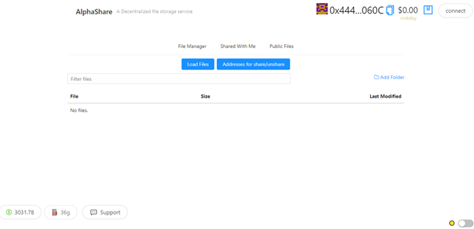

# AlphaShare

## \_A Decentralized Library, that allows users to upload files, retrieve files and share files with other users.

> everything you need to know about AlphaShare Decentralized file storage! 🚀

Live Demo
Check out the live demo here: https://gentle-polish.surge.sh/


# 🏄‍♂️ Quick Start

Prerequisites: [Node (v16 LTS)](https://nodejs.org/en/download/) plus [Yarn](https://classic.yarnpkg.com/en/docs/install/) and [Git](https://git-scm.com/downloads)

> clone/fork AlphaShare:

```bash
git clone https://github.com/Alpha-Team-7/AlphaShare.git
```

> install and start your 👷‍ Hardhat chain:

```bash
cd AlphaShare
yarn install
yarn chain
```

> in a second terminal window, start your 📱 frontend:

```bash
cd AlphaShare
yarn start
```

> in a third terminal window, 🛰 deploy your contract:

```bash
cd AlphaShare
yarn deploy
```

🔏 Edit your smart contract `AlphaShare.sol` in `packages/hardhat/contracts`

📝 Edit your frontend `App.jsx` in `packages/react-app/src`

💼 Edit your deployment scripts in `packages/hardhat/deploy`

📱 Open http://localhost:3000 to see the app

# 📚 Documentation

This documentation is segmented into developer-focused messages and end-user-facing messages. These messages may be shown to the end user (the human) at the time that they will interact with the contract (i.e. sign a transaction).

@title - Title that describes the contract
<br/>
@author - Name of the author
<br/>
@notice - Explains to an end user what a function does
<br/>
@dev - Explains to a developer any extra details
<br/>
@param - Documents a single parameter from functions and events
<br/>
@return - Documents one or all return variable(s) from a function
<br/>

User and Developer Documentation can be found [here](https://github.com/Alpha-Team-7/AlphaShare/blob/master/documentation.json)

# 🔭 Learning Solidity

📕 Read the docs: https://docs.soliditylang.org

📧 Learn the [Solidity globals and units](https://docs.soliditylang.org/en/latest/units-and-global-variables.html)
